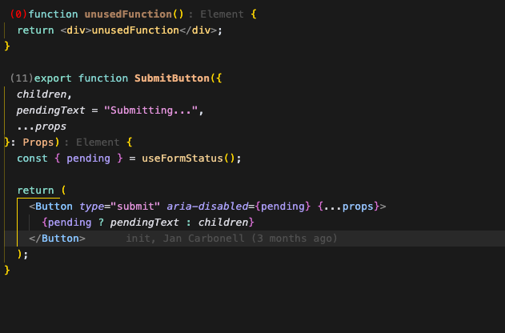
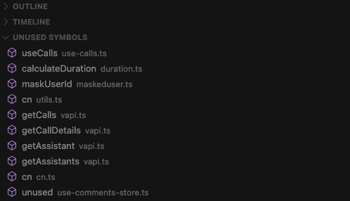

# Reference Counter for VSCode

If you like this extension, please consider starring the repo on GitHub: [reference-counter](https://github.com/gosvig123/reference_count_extension),
if you have any suggestions or feedback, please open an issue on the repo. We also welcome pull requests as long as they are in the spirit of the project and backwards compatible!

The goal of this extension is to help you understand usage of functions, classes, and methods in your code, while you are writing it.

I developed this extension to find unused functions, classes, and methods in my codebase, and understand how much care I need to take when refactoring, portrayed in a single number.

A Visual Studio Code extension that displays the number of references for functions, classes, and methods directly in your code editor and helps you identify unused code.

## Screenshots

### Reference Counting

### Unused Symbols Detection

## Features

- Shows reference counts inline next to:
  - Functions
  - Classes
  - Class methods
- Automatically updates when you edit code
- Supports multiple programming languages:
  - Python (`.py`)
  - JavaScript (`.js`, `.jsx`)
  - TypeScript (`.ts`, `.tsx`)
- Configurable file exclusion patterns
- Identifies unused symbols in your workspace:
  - Find unused functions, classes, and methods
  - View results in a dedicated sidebar
  - Dynamic updates as you edit files
  - Performance-optimized to only analyze changed files

## Unused Symbols View

The extension adds an "Unused Symbols" view to the Explorer sidebar that shows all detected unused symbols. The view:

- Groups symbols by file
- Shows the symbol type (function, class, or method)
- Updates dynamically as you edit files
- Clicking on a symbol navigates to its location in the code

## Configuration

You can configure the extension through settings:

- `referenceCounter.excludePatterns`: Array of patterns to exclude from reference counting and unused symbol detection
  - Default: `["./node_modules", "./.next", "./build"]`
  - Example: To exclude all files in the 'node_modules' folder, add 'node_modules' to the list

- `referenceCounter.includeImports`: Whether to include import statements in reference count
  - Default: `false`

- `referenceCounter.minimalisticDecorations`: Use a minimalistic, compact version of the decorator
  - Default: `true`

- `referenceCounter.dynamicUpdateDelay`: Delay in milliseconds before updating unused symbols after a file change
  - Default: `1000`

- `referenceCounter.fileAnalysisCooldown`: Minimum time in milliseconds between analyses of the same file
  - Default: `5000`

## Performance Considerations

The extension is designed to be performance-friendly:

- It only analyzes files that are being edited, not the entire workspace
- It uses debouncing to prevent too-frequent updates
- It has a cooldown period to avoid analyzing the same file too often
- You can adjust the update delay and cooldown period in the settings

## How It Works

1. **Reference Counting**: The extension counts references to functions, classes, and methods in your code and displays the count inline

2. **Unused Symbol Detection**: It identifies symbols that have no references and displays them in the Unused Symbols view

3. **Dynamic Updates**: As you edit files, the extension automatically updates the reference counts and unused symbols list for the affected files